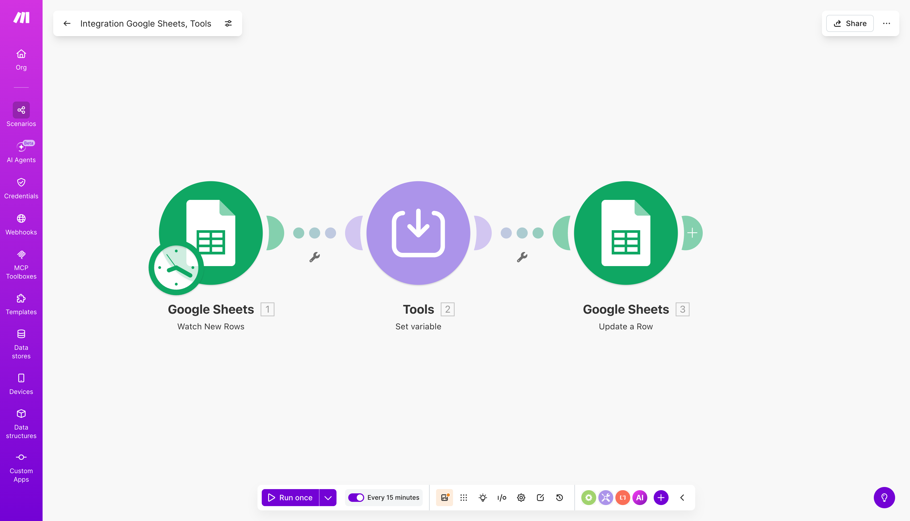
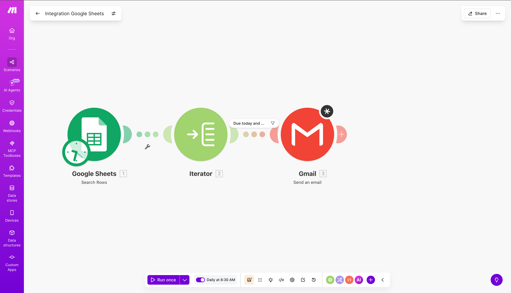

# Founder Outreach Tracker

## Problem This Solves

Important founder, investor, candidate, and partner conversations die because follow-ups live in memory, scattered sheets, or browser tabs. The problem is not outreach volume; it is follow-up discipline.

## How It Helps

- Creates a simple Google Sheets CRM with Make automation and Gmail reminders for timely follow-ups.
- Keeps the system lightweight enough that a founder, operator, or job seeker will actually maintain it.
- Turns relationship building into a daily queue instead of a manual audit.

## When To Fork This

- Fork this if you manage founder relationships, hiring conversations, investor outreach, partnerships, or a focused job search.
- Fork it when a full CRM is too heavy but a plain spreadsheet is causing missed follow-ups.
- Adapt the sheet stages, fit score, reminder window, Gmail copy, and Make scenarios to your own relationship workflow.

A lightweight automation system for managing LinkedIn outreach during a structured job search — built in Make (formerly Integromat) with Google Sheets as the data layer and Gmail as the notification layer.

I built this to manage my own search for Founder's Office and BizOps roles. Instead of losing track of 50+ contacts across spreadsheets and browser tabs, I wanted a system that told me exactly who to follow up with, every morning, without manual checking.

---

## The problem

Cold outreach to founders and operators only converts if you follow up at the right time — 4 to 6 days after the first message, before you fall out of their inbox context. Most people don't follow up at all. The ones who do follow up manually forget, or follow up too late, or follow up on the wrong people while the high-fit ones go cold.

The standard fix is a CRM. But a full CRM is overkill for 50–100 contacts, and it adds friction that kills the habit of logging contacts consistently.

This system sits in the middle: a Google Sheet you can update in 10 seconds, with automated reminders so you never miss a follow-up window.

---

## How it works

### Google Sheet (data layer)

A single sheet with 15 columns tracks every outreach contact from first identification through reply or close. The sheet is the source of truth — both Make scenarios read from and write to it.

**Columns tracked:**

| Column | What it captures |
|--------|----------------|
| Contact Name | Full name |
| Company | Company name |
| Role / Title | Their current title |
| LinkedIn URL | Direct link to profile |
| Message Type | Connection Request / Direct DM / InMail |
| Stage | Current status in the outreach funnel |
| Fit Score | 1–5 rating of role and mission alignment |
| Date Added | When the row was created |
| Message Sent Date | Date of first outreach message |
| Last Activity Date | Date of most recent action |
| Follow-up Due | Auto-set by Scenario 1 (Message Sent Date + 5 days) |
| Source | How you found them (LinkedIn Search / Alumni Network / Referral) |
| Notes | Anything useful for personalising the follow-up |
| Next Action | One specific next step |

**Stages in the funnel:**

`Identified` → `Connection Request Sent` → `Message Sent` → `Replied` → `Meeting Booked` → `Followed Up` → `Closed – No Response` / `Closed – Converted`

---

### Make automation (logic layer)

Two scenarios handle all automation.

**Scenario 1: New row handler**

Triggers on every new row added to the sheet (polls every 15 minutes). Uses a Tools module to calculate the follow-up date as Message Sent Date + 5 days, then writes it back to Column L automatically. You never manually set a follow-up date.

**Scenario 2: Daily follow-up reminder**

Runs at 9 AM IST every day. Fetches all rows from the sheet, iterates through them, and filters for rows where:

- Follow-up Due = today's date
- Stage is not `Meeting Booked`, `Closed – No Response`, or `Closed – Converted`

For each match it sends a formatted Gmail to your inbox with the contact's name, company, LinkedIn URL, stage, and next action pre-filled. You open Gmail at 9 AM and know exactly who to reach out to.

---

## Sheet template

The Google Sheet template is available as a CSV download:

[sheet-template.csv](sheet-template.csv)

**To import into Google Sheets:**  
File → Import → Upload → select `sheet-template.csv` → Separator type: Comma → Replace current sheet.

---

## Setup

See [docs/make-scenario-setup.md](docs/make-scenario-setup.md) for step-by-step instructions to build both scenarios, including module settings, field mappings, and the Gmail body template.

---

## What I learned building this

The most useful design decision was keeping the Google Sheet as a simple flat table with no formulas, rather than a relational structure with lookup columns. Make reads faster with simple rows, and you can filter and sort in Google Sheets without breaking the automation.

The 5-day follow-up window came from testing — most founders and operators who reply at all reply within 4 days. Following up on day 5 catches the ones who opened the message but got distracted, which is the highest-conversion group.

The Fit Score column is more useful than it looks. After two weeks you can sort by Fit Score and see exactly where you spent your outreach energy vs where you got replies — a fast feedback loop for improving targeting.

---

## Stack

- **Make** (automation and scheduling)
- **Google Sheets** (data layer)
- **Gmail** (notification layer)

No paid APIs. No code. Total build time: ~2.5 hours.

---

## Author

Shubham Singh — [LinkedIn](https://linkedin.com/in/shubham9616)

Process Analyst with a background in RevOps, CRM infrastructure, and data analytics. Currently targeting Founder's Office, BizOps, and Strategy roles.
